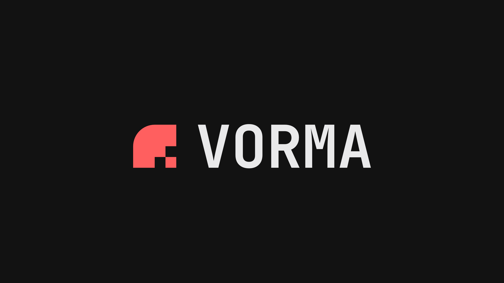

# Vorma Framework



---

Vorma seeks to be the world's most straightforward web framework.

## Links

[vorma.dev](https://vorma.dev) | [github.com](https://github.com/vormadev/vorma)
| [pkg.go.dev](https://pkg.go.dev/github.com/vormadev/vorma) |
[npmx.dev](https://npmx.dev/package/vorma) | [x.com](https://x.com/vormadev)

## Quick Start

```sh
npm create vorma@latest
```

## Status

Expect frequent breaking changes while we are still sub-`v1.0.0`.
