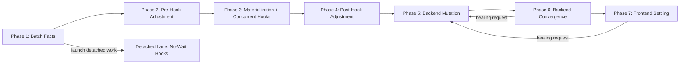

# Wave2 DAG Proposal

## Goal

Model Wave2 from first principles around Wave 1's observed behavior, while
leaning as hard as possible on `kit/tasks` for dependency ordering, dedupe, and
parallelism.

The core rule is:

- Phase effect sets contain only terminal roots.
- Terminal roots own all of their own prerequisite DAG.
- Phase orchestration only chooses terminal roots, runs them, merges their
  outputs, and crosses real ordering barriers.

Anything else is phase code doing scheduler work that should belong to
`kit/tasks`.

## Key Principles

1. A phase boundary should exist only when later root selection depends on
   earlier outputs, or when the external world must converge before the next
   step can be correct.
2. Terminal roots should represent terminal outcomes or terminal output
   surfaces, not implementation sub-steps.
3. Additive terminal outcomes should be separate roots so `kit/tasks` can fan
   them out in parallel and dedupe shared prerequisites.
4. Mutually exclusive terminal outcomes should usually be one switch-root,
   because exposing mutually exclusive siblings in the effect set does not buy
   parallelism and leaks selection logic into the phase layer.
5. Some terminal roots should still remain singular even when they are not
   mutually exclusive, if they represent one coupled convergence or healing
   policy domain whose internal ordering should not leak back up into the phase
   layer.
6. Planner tasks are not part of the effect set. A planner reduces prior facts
   into a request struct. The effect set is only the terminal roots that may be
   selected from that request.

## Recommended Model

I do not think the current five critical-path phases are the clean final shape.

The missing boundaries are the hook timing barriers that Wave 1 really has:

- pre hooks
- build plus concurrent hooks
- post hooks

Those are not cosmetic distinctions. They change which actions may still affect
build work, restart work, and browser work.

My recommendation is:

- seven critical-path phases
- one detached no-wait lane that is deliberately outside the critical path

## Overall Flow

## Detached No-Wait Lane

This should not be a numbered phase.

Reason:

- it does not gate the critical path
- it can outlive the batch
- it is intentionally fire-and-forget

So the clean model is:

- after phase 1, launch `launch_no_wait_hooks`
- do not let it define later phase selection
- give it its own execution lifetime

It can still use `kit/tasks` internally, but it should not distort the
critical-path phase graph.

## Phase 1: Batch Facts

### Why this phase exists

This is the pure reduction boundary from raw watcher/config/runtime inputs into
semantic batch facts.

### Terminal root

- `derive_batch_facts`

### Terminal output

- normalized config snapshot
- semantic config diff facts
- normalized event classes
- hook-eligible event groupings
- initial app-requested outcomes
- initial framework-requested outcomes
- dominant lifecycle flags
- initial build/browser intents

### What belongs inside this root

- parse and normalize authored config
- compare semantic config against prior snapshot
- normalize and dedupe watcher events
- classify into semantic event facts
- match watch rules
- derive hook contexts and hook grouping keys
- extract app-requested and framework-requested intents

### What does not belong in the phase effect set

- any build task
- any restart task
- any browser task
- any hook execution task

## Phase 2: Pre-Hook Adjustment

### Why this phase exists

Wave 1 lets pre hooks change what should happen before build work starts.

That is a real barrier.

### Terminal root

- `apply_pre_hook_adjustments`

### Terminal output

- adjusted batch request after pre-hook actions
- pre-hook failure facts
- restart short-circuit facts

### What belongs inside this root

- resolve pre-hook execution plans
- run them in deterministic order
- collect refresh actions
- reduce those actions into updated requested outcomes
- stop early if configured failure or restart policy requires it

## Phase 3: Materialization + Concurrent Hooks

### Why this phase exists

Wave 1 runs implicit build work and concurrent hooks at the same time, then
waits for both before continuing.

That means this is one phase with multiple additive terminal roots.

### Terminal roots

- `materialize_wave_metadata`
- `materialize_go_binary`
- `materialize_critical_css_state`
- `materialize_normal_css_state`
- `materialize_public_asset_state`
- `materialize_private_asset_state`
- `materialize_frontend_bundle_state`
- `execute_concurrent_hooks`

### Why these should be separate roots

These are additive surfaces that can be requested independently and can often
run in parallel.

Examples:

- Go compile does not need to block CSS bundling.
- Public asset reconciliation does not need to block private asset
  reconciliation.
- Concurrent hooks should coexist with build roots instead of being hidden
  behind a phase-level wrapper.

### What each root should own

`materialize_wave_metadata`

- ensure dist layout
- emit runtime config artifact
- emit schema
- emit keep file
- finalize any Wave-owned metadata that should always stay coherent with the
  selected build surfaces

`materialize_go_binary`

- any Go overlay prep
- Go compile
- binary placement

`materialize_critical_css_state`

- critical CSS graph prep
- critical CSS bundle/write

`materialize_normal_css_state`

- normal CSS graph prep
- current CSS artifact write
- ref write

`materialize_public_asset_state`

- public asset scan or incremental reconciliation
- stale output cleanup for public assets
- public file map gob
- canonical public file map artifact
- public file map ref

`materialize_private_asset_state`

- private asset scan or incremental reconciliation
- private file map gob

`materialize_frontend_bundle_state`

- Vite prod build or equivalent frontend bundle materialization
- manifest emission

`execute_concurrent_hooks`

- resolve concurrent-hook execution plans
- run them
- reduce refresh actions into concurrent-hook facts

### Important note

The current rewrite is specifically wrong to expose non-terminal build steps as
effect-set members. For this phase, the effect set should name only these
terminal surfaces. All of the current `prepare_*`, `write_current_*`, and
similar implementation steps should become private prerequisite tasks.

## Phase 4: Post-Hook Adjustment

### Why this phase exists

Wave 1 runs post hooks only after build plus concurrent-hook work has settled.

That is another real barrier.

### Terminal root

- `apply_post_hook_adjustments`

### Terminal output

- final requested outcomes before backend mutation
- post-hook failure facts
- restart short-circuit facts

### What belongs inside this root

- resolve post-hook execution plans
- run them in deterministic order
- collect refresh actions
- reduce them into the final mutation/convergence/frontend request

## Phase 5: Backend Mutation

### Why this phase exists

This is the point where the system mutates backend processes and framework-owned
backend state.

### Recommended terminal root shape

Use one switch-root:

- `apply_backend_mutation_plan`

### Why this should be one root

This phase contains a mutually exclusive dominant domain:

- queue retry wait restart
- restart dev-server cycle
- normal backend mutation batch

Exposing those as sibling terminal roots just forces the phase layer to act as
the selector. A single switch-root is cleaner.

### What belongs inside this root

1. Switch on dominant lifecycle plan.
2. If the plan is `queue_retry_wait_restart`, do only that.
3. If the plan is `restart_dev_server_cycle`, do only that and end the batch.
4. Otherwise run additive mutation subtasks in parallel as needed:

- `restart_app_runtime`
- `restart_vite_runtime`
- `execute_framework_backend_mutations`

### Terminal output

- mutation result facts
- readiness requirements for the next phase
- batch-stop flag for dev-cycle restart

## Phase 6: Backend Convergence

### Why this phase exists

After backend mutation, later actions are not correct until the backend has
converged to the new requested state.

This is where app readiness, Vite readiness, and framework-facing convergence
work belong.

### Recommended terminal root shape

Use one convergence-policy root:

- `converge_backend_state`

### Why this should be one root

This is not a mutually exclusive domain.

Readiness waits, framework notifications, and framework runtime reload calls
share one convergence policy domain:

- they gate frontend settling
- they may trigger healing
- they may require app or Vite readiness first

Some of the sub-operations inside this root may still run additively when the
selected convergence policy allows it.

Splitting them into sibling terminal roots would still make the phase layer
reason about their ordering and recovery policy. One convergence root keeps that
policy in the DAG where it belongs.

### What belongs inside this root

- wait for app readiness when required
- wait for Vite readiness when required
- execute framework convergence notifications
- execute framework runtime reload calls that must happen before browser
  signaling
- emit healing request if failure policy says to repair backend state instead of
  failing the pipeline

### Terminal output

- convergence facts
- optional healing mutation request
- skip-frontend flag when appropriate

## Phase 7: Frontend Settling

### Why this phase exists

Wave 1 chooses exactly one terminal browser action for a batch.

That is a mutually exclusive domain.

### Recommended terminal root shape

Use one switch-root:

- `apply_frontend_terminal_action`

### Why this should be one root

Only one of these should happen:

- no browser action
- CSS hot reload
- revalidate
- notify Vite public-file-map changed
- hard reload

A single switch-root is cleaner than exposing five mutually exclusive siblings.

### What belongs inside this root

- switch on terminal browser action
- execute the chosen browser-side effect
- if notify-Vite fails, emit a healing request instead of pretending that the
  terminal browser action succeeded

### Terminal output

- frontend completion summary
- optional healing mutation request

## Healing Model

Healing should not be a separate permanent phase.

It should be represented as a follow-up mutation request emitted by phase 6 or
phase 7, which re-enters phases 5 through 7.

That keeps the main phase graph simple while still modeling:

- backend restart without Go compile
- Vite restart plus readiness
- hard-reload fallback after failed Vite notify

## Choosing Root Shapes

This is the rule I recommend.

Use one switch-root when:

- the domain is mutually exclusive
- there is no benefit to exposing losing branches as schedulable roots
- the branches share one failure or healing policy
- the branches are better modeled as one selected terminal outcome

Use separate terminal roots when:

- the outcomes are additive
- they may legitimately co-run
- they have meaningful independent prerequisite graphs
- selecting them independently allows more real parallelism

Use one non-switch policy root when:

- the work is not mutually exclusive
- the sub-operations still belong to one coupled convergence or healing policy
- exposing them as sibling roots would leak ordering or repair policy into the
  phase layer
- any additive work inside the domain can still be parallelized as private
  prerequisite tasks beneath that root

Applied here:

- phase 3 should use separate additive roots
- phase 5 should use one switch-root
- phase 6 should use one convergence-policy root
- phase 7 should use one switch-root

## Phase Orchestration Shape

The phases should remain explicit orchestration barriers, but the ceremony
around them should be centralized.

I do not think phases themselves should be modeled as chained task roots whose
only purpose is "phase N depends on phase N-1".

Reason:

- phase transitions are control flow, not ordinary work dependencies
- later phase root selection depends on earlier phase outputs
- stop, short-circuit, detached-lane launch, and healing loopback are batch
  orchestration concerns
- putting that into the task DAG would blur the boundary between
  `kit/tasks`-owned dependency logic and orchestrator-owned batch control flow

So the clean shape is:

- one generic `run_phases(...)`
- one ordered slice of plain `phase_definition` values
- each `phase_definition` names the `phase_name`
- each `phase_definition` names the `planner_task`
- each `phase_definition` defines how terminal roots are selected from planner
  output
- each `phase_definition` defines how phase outputs merge back into batch state
- each `phase_definition` defines what continuation, stop, detached-lane launch,
  or loopback decision to make

Important constraint:

- centralize only the repeated phase ceremony
- do not add wrapper stacks, builder patterns, or a second scheduler
- keep actual phase semantics explicit in each `phase_definition`

## What This Means For Current Wave2

The current rewrite is directionally right about moving to phases plus
`kit/tasks`, but the phase boundaries and effect-set contents are still too
transitional.

The biggest architectural corrections are:

1. Split the current model into seven critical-path phases, because pre hooks,
   build plus concurrent hooks, and post hooks are real ordering barriers.
2. Remove non-terminal implementation steps from effect sets.
3. Let phase 3 expose additive artifact surfaces as separate terminal roots.
4. Let phase 5 expose one switch-root for backend lifecycle selection.
5. Let phase 6 expose one convergence-policy root for backend readiness,
   notifications, reload calls, and healing.
6. Let phase 7 expose one switch-root for the terminal frontend action.
7. Treat no-wait hooks as a detached lane, not a normal phase.
8. Centralize phase ceremony in one `run_phases(...)` runner instead of
   repeating plan, root selection, execution, merge, and next-step mechanics in
   every phase.
9. Do not model phases themselves as chained task roots.

## Suggested Numeric Mapping

If numeric labels are still preferred for the implementation, I would map them
like this:

1. `phase_1`: batch facts
2. `phase_2`: pre-hook adjustment
3. `phase_3`: materialization plus concurrent hooks
4. `phase_4`: post-hook adjustment
5. `phase_5`: backend mutation
6. `phase_6`: backend convergence
7. `phase_7`: frontend settling

Detached lane:

- `launch_no_wait_hooks`

## Bottom Line

The clean model is not "five phases with better effect sets."

The clean model is:

- seven critical-path phases
- one detached no-wait lane
- additive build surfaces exposed as separate terminal roots
- mutually exclusive backend lifecycle and frontend action domains exposed as
  single switch-roots
- backend convergence exposed as one policy root, not a fake mutually exclusive
  domain
- one small `run_phases(...)` orchestrator for phase ceremony, with `kit/tasks`
  handling the real DAG work inside each phase
- all real prerequisite structure pushed down into `kit/tasks`

That is the shape that most faithfully matches Wave 1 behavior while making
Wave2 genuinely task-native instead of only partially task-native.
